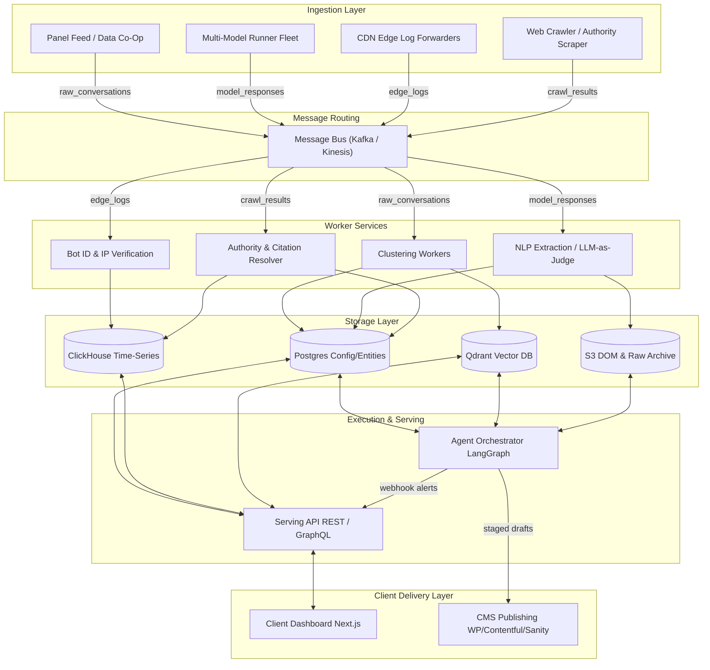

# System Architecture & Scaling Blueprint

This document details the system-level architecture, ingestion pipelines, message routing pathways, and infrastructure configurations required to scale a production-grade GEO/AEO platform.

---

## 1. System Topology

The system uses a shared spine consisting of:
- **Ingestion Nodes**: Process incoming log events, active queries, and licensed panel data.
- **Message Bus (Kafka/Kinesis)**: Decouples ingestion spikes from downstream processing workers.
- **Analytical & Columnar Datastores (ClickHouse)**: Optimized for raw log streams and time-series metrics.
- **Transactional Datastores (PostgreSQL)**: Manages configuration metadata, user profiles, actions, and CMS adapters.
- **Vector Index (Qdrant)**: Stores prompt embeddings and supports nearest-neighbor cluster assignments.
- **Agent Orchestrator (LangGraph + Temporal/Celery)**: Governs async content generation, verification loops, and human-in-the-loop gates.

### Mermaid System Diagram

---

## 2. Subsystem Data Flow

1. **Prompt Volumes Pipeline**: Raw panel feeds are normalized, scrubbed of PII, and run through embedding models. They are written to Qdrant for real-time ANN cluster assignment and batch-processed nightly (HDBSCAN) to update PostgreSQL's taxonomy tables and ClickHouse's extrapolation models.
2. **Answer Engine Insights (AEI) Engine**: Daily scheduled runs generate localized prompt sets. Headless browsers (Playwright) and API adapters execute prompts and write raw text and DOMs to S3. NLP judge workers extract brands and citations, persisting aggregated rollups in ClickHouse.
3. **Agent Analytics Ingestion**: CDN edge forwarders stream client request logs. Bot-verification workers confirm crawler legitimacy by matching User-Agents and resolving IP ranges, writing metrics directly to ClickHouse.
4. **Agentic Workflows**: LangGraph orchestration loops query ClickHouse/Postgres for gap alerts, draft briefs, generate fact-grounded content, run self-verification loops, and queue approved items for publication via CMS adapters.

---

## 3. Scalability Mapping (MVP vs. Production vs. Enterprise)

### MVP (Minimum Viable Product)
* **Ingestion Layer**: Single-threaded crawler run from cron jobs; direct model API execution. No proxy pools or panel licensing.
* **Message Routing**: None (direct synchronous HTTP/gRPC calls or simple SQLite queues).
* **Storage Layer**: Shared PostgreSQL instance for metadata, basic transactional data, and vector indexing (using `pgvector`). Raw responses stored locally or on a shared NFS. No ClickHouse.
* **Workers Layer**: Python Celery daemon running on a single instance.
* **Scaling Limit**: 50 prompts, 1 client account.

### Production
* **Ingestion Layer**: Distributed Playwright fleet running inside Docker containers with rotating proxy configurations. Panel streams processed via weekly bulk ingests.
* **Message Routing**: Amazon SQS/SNS or RabbitMQ for job routing.
* **Storage Layer**: Dedicated PostgreSQL database for config and actions; multi-node ClickHouse cluster for time-series log ingestion; managed Qdrant Cloud cluster for vector storage; AWS S3 bucket for DOM snapshots.
* **Workers Layer**: Celery/temporal workers running on independent AWS ECS tasks, scaling dynamically based on queue depth.
* **Scaling Limit**: 1,000 prompts, 100 client accounts.

### Enterprise
* **Ingestion Layer**: Globally distributed browser fleets simulating residential IP blocks across multiple ISP configurations. Continuous, streaming ingestion from panel providers.
* **Message Routing**: Multi-region Apache Kafka cluster with partition keys aligned to client account IDs to prevent noisy-neighbor issues.
* **Storage Layer**: High-availability Postgres with replica read-nodes; ClickHouse shards distributed via Zookeeper; Qdrant cluster on Kubernetes with local disk persistence (HNSW indexing optimized for fast recall).
* **Workers Layer**: Kubernetes-orchestrated Python/Go runtimes, leveraging GPU nodes for local embedding models (BGE-large) to optimize pipeline speed.
* **Scaling Limit**: 10,000+ prompts, 1,000+ client accounts.

---

## 4. Architectural Summary Table

| Dimension | [CONFIRMED] Findings | [INFERRED] Systems Behavior | [ASSUMPTION] System Limits | [RECOMMENDATION] Optimization |
|---|---|---|---|---|
| **Ingestion Pipeline** | Ingestion splits into active execution and licensed panel feeds. | Playwright fleets simulate logged-in consumer UI paths at scale. | Anti-scraping defenses on consumer UI require proxy rotation. | Implement residential proxy rotation + browser fingerprinters. |
| **Log Analytics** | Telemetry logs are collected at the CDN level without JS tracking. | Logs are routed in real-time to prevent log loss during spikes. | CDN log ingestion limits depend on provider API bounds. | Use Cloudflare logpush or AWS Data Firehose streaming directly. |
| **Message Queue** | A message bus routes raw payloads to NLP/Extraction stages. | SQS/Kafka acts as a buffer between crawlers and LLM-as-judge calls. | Large DOM and text payloads overwhelm standard queues. | Store raw payloads in S3 and route lightweight keys through the bus. |
| **Vector Storage** | Prompts are clustered semantically using embeddings. | Qdrant/pgvector performs ANN queries for real-time categorizations. | Batch clustering drift shifts centroid boundaries. | Run fast online ANN updates daily, recluster via HDBSCAN weekly. |
