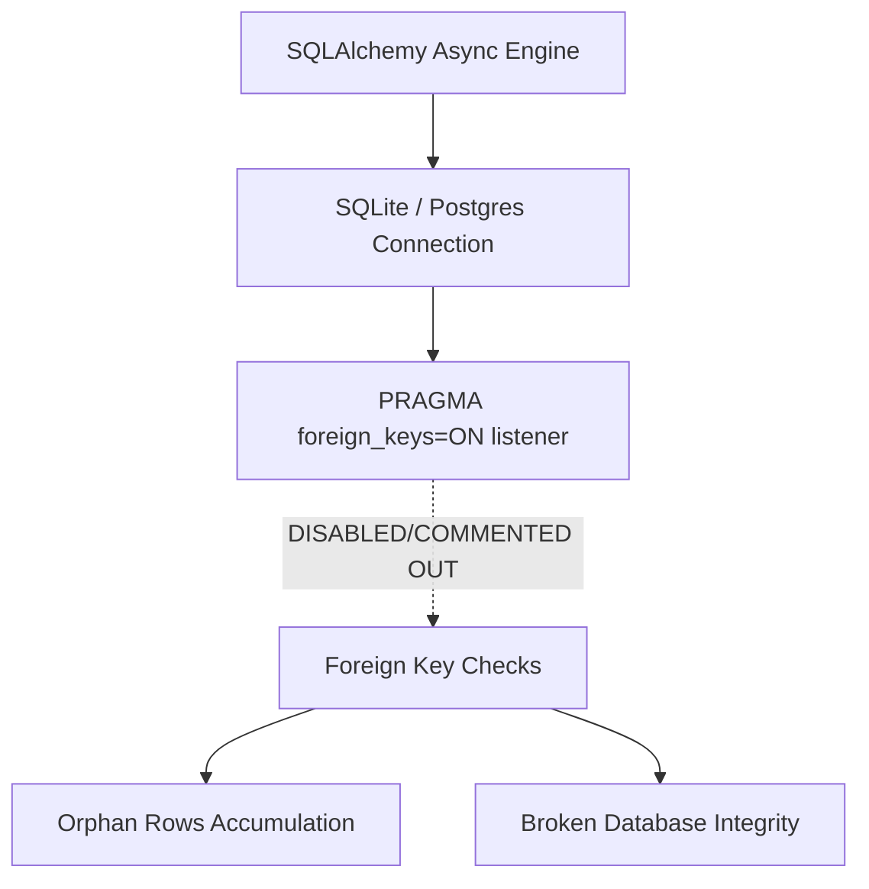

# Database Subsystem Audit

An assessment of the database schema design, migrations, indexing, constraints enforcement, and multi-tenant isolation.

---

## Schema Architecture & Integrity

The database is built on SQLAlchemy declarative mapping. Migrations are managed via Alembic. By default, the application is configured to run against PostgreSQL, but falls back to a local SQLite database file (`geo_db.sqlite`) for local developer setups.

### Critical Database Issues



#### 1. Disabled SQLite Foreign Key Constraints
* **The Root Issue**: In [database.py](file:///e:/Profound-cloning/backend/app/core/database.py#L14-L19), the event listener responsible for enforcing foreign keys on SQLite connections is commented out:
  ```python
  # if settings.DATABASE_URL.startswith("sqlite"):
  #     @event.listens_for(engine.sync_engine, "connect")
  #     def set_sqlite_pragma(dbapi_connection, connection_record):
  #         cursor = dbapi_connection.cursor()
  #         cursor.execute("PRAGMA foreign_keys=ON")
  #         cursor.close()
  ```
* **The Impact**: Because this is disabled, **SQLite ignores all foreign key constraints** (`ondelete="CASCADE"`, `ForeignKey("workspaces.id")`, etc.). Deleted parents leave behind orphan children, and the application cannot guarantee relational database integrity.

#### 2. Complete Lack of Database Indexes
* No custom database indexes are defined on major query keys. 
* Fields like `brand_id` in `visibility_scores` and `visibility_history`, `project_id` in `prompts` and `recommendations`, and `recorded_date` in `share_of_voice` are queried frequently (such as on dashboard loads or daily scanning worker loops).
* **The Impact**: Querying these tables will scan the entire database (full table scans), causing critical performance bottlenecks as the visibility tracking history scales to thousands of rows.

#### 3. Soft Multi-Tenant Isolation
* **The Root Issue**: Multi-tenancy is structured at the `Organization` level, with users belonging to an organization and workspaces mapped to an organization.
* **The Impact**: There is no database-level row protection (such as Postgres Row Level Security or dynamic schema routing). Tenant isolation relies entirely on developers remembering to join tables and check organization IDs in the application routes. As shown in the backend audit, multiple endpoints (brands, competitors, agency clients) completely omit these validation checks, leading to data leaks.
