# Launch Candidate Gap Analysis

This document identifies the remaining security, infrastructure, reliability, and deployment gaps that must be resolved to elevate the repository to a production-ready Launch Candidate.

---

## 🚨 Prioritized Gap Analysis

### 🔴 P0: Launch Blockers

#### 1. Invalid and Insecure CORS Configuration
* **Exact File Path**: [backend/app/main.py](file:///e:/Profound-cloning/backend/app/main.py)
* **Exact Line Numbers**: 19-25
* **Root Cause**: The application configures `allow_origins=["*"]` combined with `allow_credentials=True`. Starlette/FastAPI's CORS middleware throws a runtime assertion error if these options are combined. If bypassed or deployed, modern browsers will block any credentialed requests (containing JWTs in headers or cookies) from reaching the API.
* **Fix Strategy**: Replace the wildcard origin with a list of verified domains read from configuration (e.g., `settings.ALLOWED_ORIGINS` which lists the staging and production frontend URLs).
* **Estimated Effort**: 10 minutes

#### 2. Hardcoded Absolute Windows File Path in Analysis Worker
* **Exact File Path**: [backend/app/modules/analysis/service.py](file:///e:/Profound-cloning/backend/app/modules/analysis/service.py)
* **Exact Line Numbers**: 975
* **Root Cause**: The email logging function hardcodes `log_dir = r"e:\Profound-cloning\docs\implementation\logs\emails"`. In any environment other than the developer's local machine (such as a Linux-based Docker container or standard staging server), the directory creation or file writing will fail, causing background worker tasks to crash.
* **Fix Strategy**: Resolve the path relative to the application base folder or configure the logs directory via environment settings (e.g. `settings.LOGS_DIR`).
* **Estimated Effort**: 5 minutes

---

### 🟡 P1: Must Fix Before First Customers

#### 1. Synchronous Model Loading at Module Import Level
* **Exact File Path**: [backend/app/modules/analysis/service.py](file:///e:/Profound-cloning/backend/app/modules/analysis/service.py)
* **Exact Line Numbers**: 15-25
* **Root Cause**: Heavy NLP packages (`KeyBERT` and `SentenceTransformer`) are instantiated at the module level. Merely importing `AnalysisService` synchronously triggers a download of the `all-MiniLM-L6-v2` model weights (~120MB) from Hugging Face. In production container networks or offline servers, this will block startup, hang the event loop, or cause deployment timeouts.
* **Fix Strategy**:
  1. Move the model instantiation into a lazy-load function (instantiated only when the worker needs to process keywords/topics).
  2. Add a caching script to the `Dockerfile` to download and serialize model weights during the Docker image build phase so they are bundled with the container.
* **Estimated Effort**: 30 minutes

#### 2. Socket Descriptor Exhaustion via Per-Request Redis Connections
* **Exact File Paths**:
  - [backend/app/core/rate_limit.py](file:///e:/Profound-cloning/backend/app/core/rate_limit.py) (Lines 22, 34)
  - [backend/app/modules/analysis/router.py](file:///e:/Profound-cloning/backend/app/modules/analysis/router.py) (Lines 95, 98)
  - [backend/app/modules/prompts/service.py](file:///e:/Profound-cloning/backend/app/modules/prompts/service.py) (Lines 55, 91)
* **Root Cause**: The rate limiter and routers open a new Redis client/connection pool using `Redis.from_url` or `create_pool` on *every single request* that triggers rate limiting, request audits, or prompt runs, and then close it. Under high concurrency in production, this will cause high latency, socket descriptor depletion, and connection failures.
* **Fix Strategy**: Implement a persistent connection pool using FastAPI's startup and shutdown lifecycle events (or lifespan handler) and register it to `app.state.redis_pool`. Retrieve and reuse this pool across requests instead of instantiating new pools.
* **Estimated Effort**: 1 hour

#### 3. Missing Database Migrations in Container Entrypoint
* **Exact File Path**: [backend/Dockerfile](file:///e:/Profound-cloning/backend/Dockerfile)
* **Exact Line Numbers**: 21-22
* **Root Cause**: The container startup command (`CMD`) directly executes `uvicorn app.main:app` without executing database migrations. When deployed in production, the backend container will start up, but all operations will fail because the database tables do not exist.
* **Fix Strategy**: Chain the Alembic migration command before launching the server, e.g. `CMD alembic upgrade head && exec uvicorn app.main:app --host 0.0.0.0 --port $PORT` or write a dedicated `entrypoint.sh` script.
* **Estimated Effort**: 15 minutes

#### 4. Rate Limiter Fails Open in Production
* **Exact File Path**: [backend/app/core/rate_limit.py](file:///e:/Profound-cloning/backend/app/core/rate_limit.py)
* **Exact Line Numbers**: 44-47
* **Root Cause**: If the Redis client throws a connectivity exception, the rate limiter catches the error and silently passes. While this prevents developer interruption, in production, a Redis network blip or outage will leave expensive LLM endpoints (like `/recommendations/advanced` or `/prompts/run`) completely unprotected, exposing the platform to high-cost API key abuse.
* **Fix Strategy**: Check `settings.ENVIRONMENT`. If it is `"production"`, the rate limiter must fail closed (raise a HTTP 500 error or fallback to an in-memory token bucket) rather than failing open.
* **Estimated Effort**: 20 minutes

---

### 🔵 P2: Can Fix After Launch

#### 1. Insecure Fallback JWT Secret
* **Exact File Path**: [backend/app/core/config.py](file:///e:/Profound-cloning/backend/app/core/config.py)
* **Exact Line Numbers**: 24-27
* **Root Cause**: The JWT signature verification defaults to `"supabase_jwt_secret_placeholder_change_in_prod"`. If a developer forgets to configure `SUPABASE_JWT_SECRET` in a production environment, the server will start up and validate any JWTs signed with this public placeholder.
* **Fix Strategy**: Add a validation step in `Settings` that raises a ValueError on startup if `ENVIRONMENT == "production"` and `SUPABASE_JWT_SECRET` is left as the default placeholder.
* **Estimated Effort**: 10 minutes

#### 2. Redundant Local Credentials Authentication (Dual-Auth)
* **Exact File Path**: [backend/app/modules/workspaces/router.py](file:///e:/Profound-cloning/backend/app/modules/workspaces/router.py)
* **Exact Line Numbers**: 24-75
* **Root Cause**: The `/register` and `/token` endpoints allow users to signup and generate JWTs locally via hashed passwords in the local database. If Supabase is the primary authentication provider in production, this dual-auth configuration creates multiple user credential vectors and increases the surface area for security attacks.
* **Fix Strategy**: Gate local register/token endpoints behind a development environment flag so they are disabled in production, routing all authentications through the official Supabase JWT verifications.
* **Estimated Effort**: 20 minutes

---

## 📈 Prioritized Execution Plan

```mermaid
gantt
    title Launch Candidate Execution Plan
    dateFormat  X
    axisFormat %d
    
    section P0 Blockers
    Fix CORS Config (P0)              :active, task1, 0, 10
    Fix Hardcoded File Path (P0)      :active, task2, 10, 15
    
    section P1 Pre-Customer
    Lazy Load ML Models (P1)          :task3, 15, 45
    Redis Connection Pool (P1)        :task4, 45, 105
    Fix Docker Auto-Migration (P1)    :task5, 105, 120
    Secure Rate Limiter Failure (P1) :task6, 120, 140
    
    section P2 Post-Launch
    Secure JWT Secrets Check (P2)     :task7, 140, 150
    Disable Local Auth in Prod (P2)   :task8, 150, 170
```

### Action Items Summary
1. **P0 tasks (15m)**: Deploy origin checks in `app/main.py` and modify `log_dir` path resolution in `service.py`.
2. **P1 tasks (125m)**: Introduce a global lifespan event handler in FastAPI for Redis, move keyphrase extraction loading to function scopes, update the Dockerfile CMD to invoke migrations, and add strict environment checks to the rate limiter.
3. **P2 tasks (30m)**: Enhance environment validators in `config.py` and deprecate local auth endpoints in production environments.
